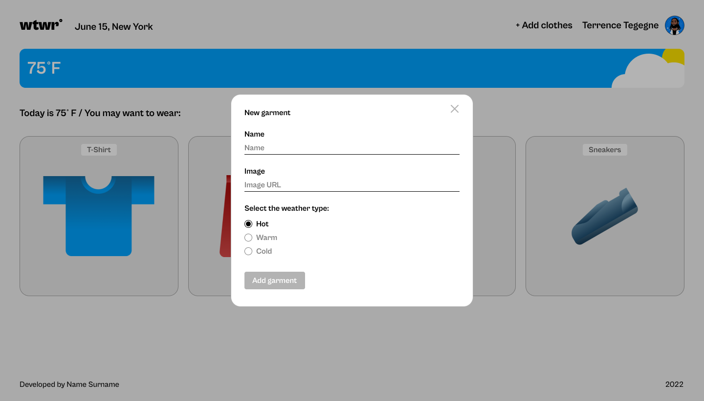
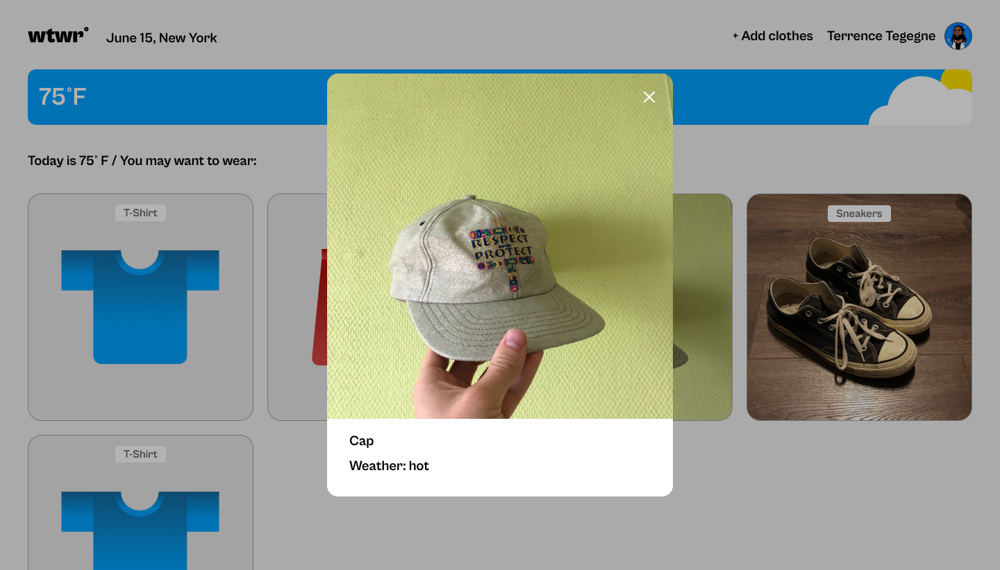
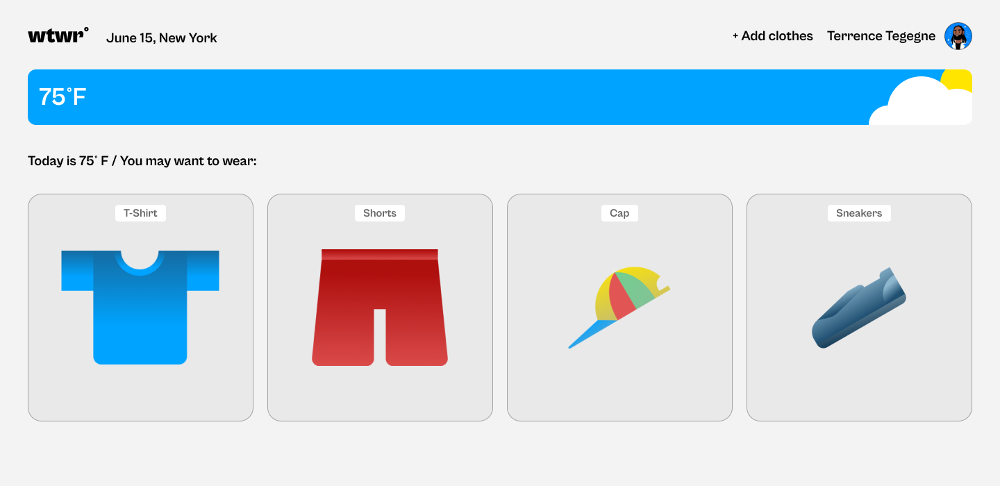

# WTWR (What to Wear) 🌦️👕🧣

## 🚀 Live Demo

Check out the project here:  
[What to Wear - Weather Station](https://aliminagar.github.io/se_project_react/)

---

## 📝 Overview

**WTWR (What to Wear)** is a dynamic, responsive web application designed to provide **clothing recommendations based on real-time weather data**. By leveraging the **OpenWeather API**, the app fetches live weather details for a user's location and suggests suitable clothing items. Additionally, users can personalize their wardrobe by adding or deleting items, all managed through an intuitive user interface.

---

## 🛠️ Features

- 🌡️ **Real-time Weather Data**: Fetches live weather information based on user geolocation.
- 👕 **Clothing Recommendations**: Suggests garments appropriate for current weather conditions.
- ➕ **Add/Delete Clothing Items**: Users can manage their wardrobe through a simple form.
- 🌀 **Smooth State Management**: Utilizes **React Hooks** for seamless component updates.
- 📱 **Responsive Design**: Optimized layout for various screen sizes.
- ⚡ **Fast Performance**: Powered by **Vite**, ensuring rapid development and build times.

---

## 🧩 Technologies Used

- **React (with Hooks)**
- **Vite (for fast development and builds)**
- **CSS (for styling and layout)**
- **OpenWeather API** (for weather data retrieval)
- **JSON Server** (for mock backend and data persistence)

---

## 📸 Screenshots

### 1️⃣ **Add Clothes Popup**

The interface where users add new clothing items by specifying the name, image URL, and weather category.


### 2️⃣ **Garment Preview**

Preview of added garments showing their details.


### 3️⃣ **Main Page**

Displays real-time weather info and clothing recommendations.


---

## ⚙️ How It Works

### 🔎 Weather Data Retrieval

- Uses the **OpenWeather API** to fetch weather data via geolocation.
- Retrieves **temperature, conditions, and location name**.

### 👕 Clothing Recommendation Logic

- Filters clothing items based on the selected **weather category** (hot, warm, cold).
- Displays items that match the current temperature range.

### 🧑‍💻 User Interaction

- **Add Clothing Item**: Opens a modal where the user can add:
  - Item name
  - Image URL
  - Weather type
- **Delete Clothing Item**: Removes the selected item from the wardrobe.

---

## 🛠️ Backend Setup (JSON Server)

The application uses **JSON Server** to simulate a backend for storing clothing items.

### Start JSON Server:

```bash
npx json-server --watch db.json --port 3001
```
